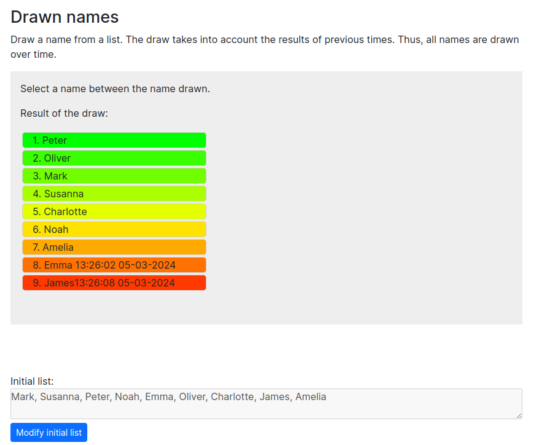

## React Name Drawer
Welcome to the React Name Drawer application! This simple React application allows you to draw a name from a list of names, taking into account the results of previous draws. This means that all names are eventually drawn over time, ensuring fairness in the selection process.

### Features
- Draw a name from a list of names.
- Keep track of previous draws to ensure fairness in subsequent selections.
- Simple and intuitive user interface.

This is a [Next.js](https://nextjs.org/) project bootstrapped with [`create-next-app`](https://github.com/vercel/next.js/tree/canary/packages/create-next-app).

### How to Use
First, run the development server:

```bash
npm run dev
# or
yarn dev
# or
pnpm dev
# or
bun dev
```

- Open [http://localhost:3000](http://localhost:3000) with your browser to see the result.

- By clicking on "Modify Initial List" you will have the opportunity to enter/edit the names you wish to draw.

- Click the "Start the draw of names" button to randomly create an ordered list of names.



- Select a name from the list, the selected name will be moved to the bottom of the list of names for subsequent draws.

- Repeat the process to draw names as needed.

### Technologies Used
- React
- Next.js
- JavaScript
- Typescript
- HTML
- CSS

### License
This project is licensed under the MIT License. See the LICENSE file for details.
